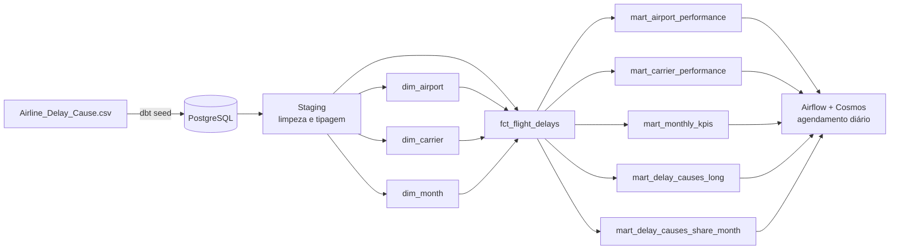

# ✈️ DW Bootcamp — Data Warehouse de Atrasos de Voos nos EUA

Pipeline de dados completo, de ponta a ponta: ingestão, modelagem dimensional, testes de qualidade e orquestração automatizada — construído com **dbt**, **Apache Airflow** e **PostgreSQL**, containerizado com **Docker** e validado por **CI/CD**.

O dataset são **~318 mil registros reais** de atrasos de voos comerciais nos EUA, transformados em um Data Warehouse analítico pronto para consumo por ferramentas de BI.

---

## 🏗️ Arquitetura



---

## 📸 O projeto em funcionamento

**Lineage graph (dbt docs)** — grafo de dependências entre staging, dimensões, fato e marts:


**Orquestração no Airflow** — DAG gerado automaticamente pelo Cosmos, cada model dbt como uma task:


**CI/CD no GitHub Actions** — pipeline completo (seed + build + test) rodando a cada push:


**Resultado em uma tabela analítica (mart)** — exemplo de dado pronto para consumo por BI:


---

## 🎯 Competências técnicas demonstradas

- **Modelagem dimensional (Star Schema)** e organização em camadas (Medallion Architecture: staging → intermediate → mart)
- **SQL e transformação de dados** com dbt, incluindo lógica de negócio, agregações e um unpivot manual via `UNION ALL`
- **Engenharia de qualidade de dados**: testes automatizados com `dbt-expectations` (integridade referencial, unicidade, valores aceitos)
- **Orquestração de pipelines** com Apache Airflow — DAGs gerados automaticamente a partir dos models dbt via `astronomer-cosmos`, com agendamento diário
- **Gestão de ambientes** (dev/prod) configuráveis por variável, sem alterar código — prática comum em times de dados
- **CI/CD**: pipeline no GitHub Actions que valida sintaxe, sobe infraestrutura efêmera e roda o build completo antes de liberar merge
- **Containerização** com Docker e gestão de dependências Python com UV

---

## 🧰 Stack

| Camada | Tecnologia |
|---|---|
| Banco de dados | PostgreSQL 17 (Docker) |
| Transformação | dbt 1.9+ (Medallion Architecture) |
| Orquestração | Apache Airflow 3.x (Astro Runtime) + astronomer-cosmos |
| Ambiente Python | Python 3.13 + UV |
| CI/CD | GitHub Actions (compile, build, test, docs) |
| Deploy prod | PostgreSQL remoto (Railway) |

---

## 📊 Modelo de dados

**Fato:** `fct_flight_delays` — cada linha representa uma combinação de mês + companhia aérea + aeroporto, com métricas de voos, atrasos, cancelamentos e minutos de atraso por causa (clima, companhia, sistema aéreo, segurança, aeronave atrasada).

**Dimensões:** `dim_airport`, `dim_carrier`, `dim_month`.

**Marts analíticos:** performance por aeroporto, performance por companhia, KPIs mensais, causas de atraso (formato long para BI) e participação percentual de cada causa por mês.

---

## 📂 Estrutura do repositório

```
├── 1_local_setup/       # Docker Compose (Postgres) + ambiente Python
├── 2_data_warehouse/    # Projeto dbt: seeds, models (staging/intermediate/mart)
├── 3_airflow/           # Projeto Astro/Airflow + DAG com Cosmos
├── .github/workflows/   # Pipeline de CI (dbt_ci.yml)
└── docs/SETUP.md        # Guia detalhado de instalação e execução
```

---

## 🚀 Rodando localmente (resumo)

```bash
git clone https://github.com/iannfava/data-warehouse-airflow-dbt.git && cd data-warehouse-airflow-dbt

# Sobe o Postgres
cd 1_local_setup && uv venv .venv && uv sync && docker compose up -d

# Roda o pipeline dbt (após criar profiles.yml — veja o guia completo)
cd ../2_data_warehouse/dw_bootcamp && dbt deps && dbt build

# (Opcional) Orquestra com Airflow
cd ../../3_airflow && astro dev start
```

📖 Passo a passo completo, com troubleshooting e configuração de conexões: **[docs/SETUP.md](docs/SETUP.md)**

---

## 📚 Referências

- [dbt](https://docs.getdbt.com) · [astronomer-cosmos](https://astronomer.github.io/astronomer-cosmos/) · [Astro CLI](https://docs.astronomer.io/astro/cli/overview) · [dbt-expectations](https://hub.getdbt.com/calogica/dbt_expectations/latest/)

---

**Autor:** Ian Fava — [GitHub](https://github.com/iannfava)
