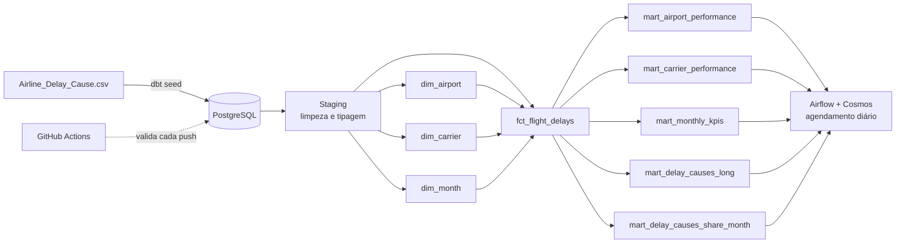
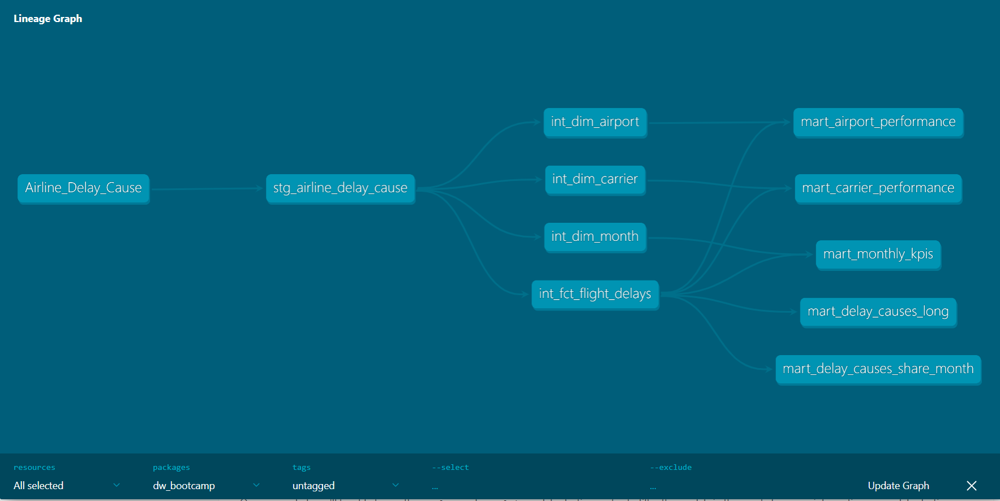
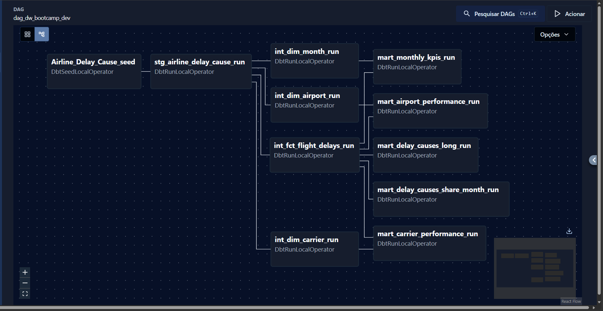
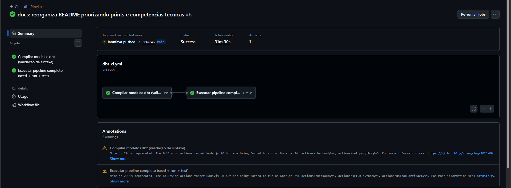
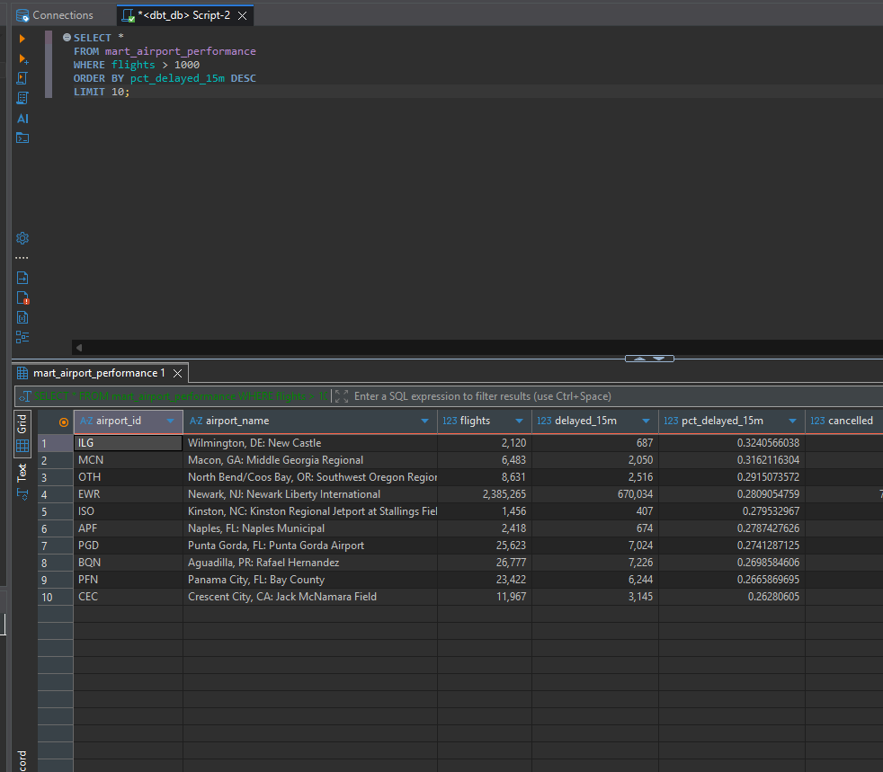

# ✈️ Data Warehouse de Atrasos de Voos nos EUA

Pipeline de dados end-to-end : ingestão, modelagem dimensional, testes de qualidade e orquestração automatizada, construído com **dbt**, **Apache Airflow** e **PostgreSQL**, containerizado com **Docker** e validado por **CI/CD**.

---

## 🎯 Problema

Transformar **~318 mil registros brutos** de atrasos de voos comerciais nos EUA em um Data Warehouse analítico confiável, testado e atualizado automaticamente  reproduzindo o fluxo de trabalho de um time de engenharia de dados em produção: dado bruto entra, dado confiável e pronto para BI sai.

---

## 🏗️ Arquitetura



**Medallion Architecture em 3 camadas:** Staging (limpeza e tipagem) → Intermediate (dimensões + fato, Star Schema) → Mart (tabelas analíticas prontas para BI). Orquestrado diariamente pelo Airflow via Cosmos, com CI/CD validando o pipeline inteiro a cada push.

---

## 🧰 Stack

| Camada | Tecnologia |
|---|---|
| Banco de dados | PostgreSQL 17 (Docker) |
| Transformação | dbt 1.9+ (Medallion Architecture) |
| Orquestração | Apache Airflow 3.x (Astro Runtime) + astronomer-cosmos |
| Ambiente Python | Python 3.13 + UV |
| CI/CD | GitHub Actions (compile, build, test, docs) |
| Deploy prod | PostgreSQL remoto (Railway) |

---

## ⚙️ Implementação

**O que foi construído:**

- **Modelagem dimensional (Star Schema)**: fato `fct_flight_delays` (mês + companhia + aeroporto) ligado a três dimensões (`dim_airport`, `dim_carrier`, `dim_month`), alimentando 5 marts analíticos.
- **Transformações em SQL via dbt**, incluindo lógica de negócio, agregações e um unpivot manual via `UNION ALL` para o mart de causas de atraso.
- **Testes de qualidade de dados automatizados** com `dbt-expectations` — integridade referencial, unicidade, valores aceitos.
- **Orquestração com Apache Airflow**: cada model dbt vira automaticamente uma task via `astronomer-cosmos`, com agendamento diário e ambientes `dev`/`prod` alternáveis por variável, sem alterar código.
- **CI/CD no GitHub Actions**: a cada push/PR, valida sintaxe, sobe um PostgreSQL efêmero, roda o build completo com testes e publica a documentação — só libera merge se tudo passar.
- **Ambiente 100% reprodutível** via Docker e UV.

**Resultado rodando de ponta a ponta:**

**Lineage graph (dbt docs)** - dependências entre staging, dimensões, fato e marts:


**Orquestração no Airflow** - DAG gerado automaticamente pelo Cosmos:


**CI/CD no GitHub Actions** - pipeline completo (seed + run + test) a cada push:


**Dado pronto para consumo** - resultado de um mart analítico:


---

## 📈 Resultados, aprendizados e próximos passos

**Resultados:** 5 tabelas analíticas prontas para BI - performance por aeroporto, performance por companhia, KPIs mensais e duas visões de causas de atraso (long e percentual por mês), todas testadas e reconstruídas automaticamente a cada execução do pipeline.

**Aprendizados:**
- Estruturar um projeto dbt em camadas que facilitam teste, manutenção e leitura do lineage.
- Integrar dbt e Airflow via Cosmos, com múltiplos ambientes de execução.
- Construir um CI que não só valida sintaxe, mas sobe infraestrutura real e roda o pipeline completo antes do merge.

**Próximos passos:**
- Conectar um dashboard de BI (Power BI/Looker) direto nos marts.
- Expandir a cobertura de testes com `dbt-expectations` para os marts.
- Adicionar alertas de falha do DAG (Slack/e-mail).

---

## 📂 Estrutura do repositório

```
├── 1_local_setup/       # Docker Compose (Postgres) + ambiente Python
├── 2_data_warehouse/    # Projeto dbt: seeds, models (staging/intermediate/mart)
├── 3_airflow/           # Projeto Astro/Airflow + DAG com Cosmos
├── .github/workflows/   # Pipeline de CI (dbt_ci.yml)
└── docs/SETUP.md        # Guia detalhado de instalação e execução
```

## 🚀 Rodando localmente (resumo)

```bash
git clone https://github.com/iannfava/data-warehouse-airflow-dbt.git && cd data-warehouse-airflow-dbt

# Sobe o Postgres
cd 1_local_setup && uv venv .venv && uv sync && docker compose up -d

# Roda o pipeline dbt (após criar profiles.yml — veja o guia completo)
cd ../2_data_warehouse/dw_bootcamp && dbt deps && dbt build

# (Opcional) Orquestra com Airflow
cd ../../3_airflow && astro dev start
```

📖 Passo a passo completo, com troubleshooting e configuração de conexões: **[docs/SETUP.md](docs/SETUP.md)**

---

## 📚 Referências

- [dbt](https://docs.getdbt.com) · [astronomer-cosmos](https://astronomer.github.io/astronomer-cosmos/) · [Astro CLI](https://docs.astronomer.io/astro/cli/overview) · [dbt-expectations](https://hub.getdbt.com/calogica/dbt_expectations/latest/)

---

**Autor:** Ian Fava - [GitHub](https://github.com/iannfava)
