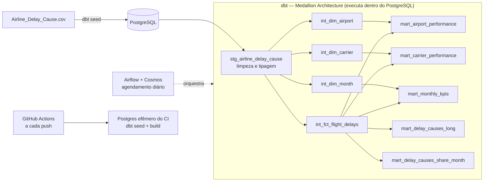
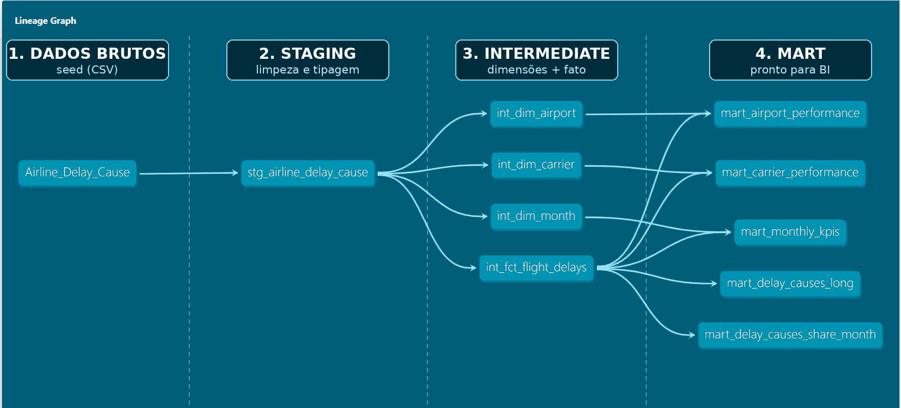
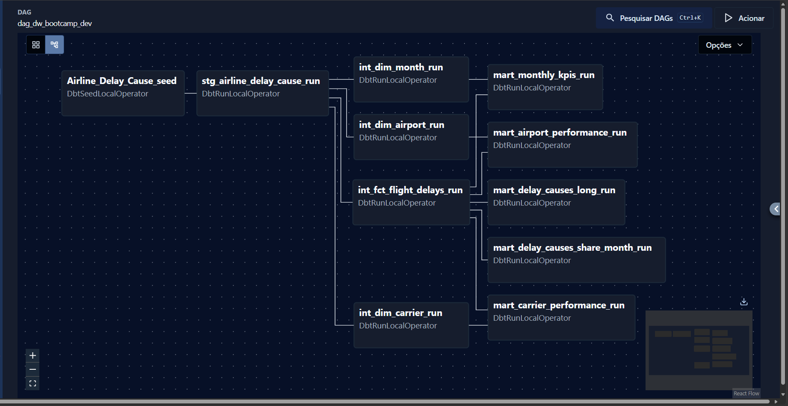
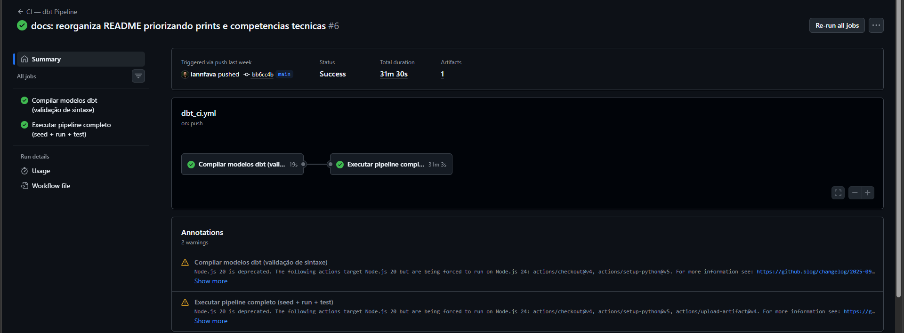
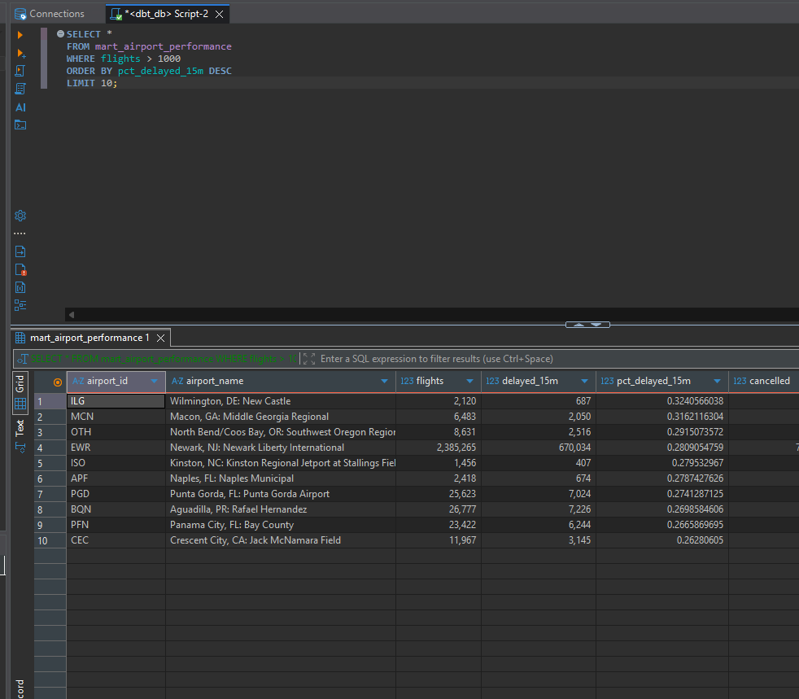

# ✈️ Data Warehouse de Atrasos de Voos nos EUA

Pipeline de dados end-to-end: ingestão, modelagem dimensional e orquestração automatizada, construído com **dbt**, **Apache Airflow** e **PostgreSQL**, containerizado com **Docker** e validado por **CI/CD**.

---

## 🎯 Problema

Transformar **~318 mil registros brutos** de atrasos de voos comerciais nos EUA em um Data Warehouse analítico estruturado e atualizado automaticamente, reproduzindo o fluxo de trabalho de um time de engenharia de dados em produção: dado bruto entra, dado estruturado e pronto para BI sai.

---

## 🏗️ Arquitetura


```mermaid
flowchart LR
    A[Airline_Delay_Cause.csv] -->|dbt seed| B[(PostgreSQL)]

    subgraph DBT["dbt — Medallion Architecture (executa dentro do PostgreSQL)"]
        C[stg_airline_delay_cause\nlimpeza e tipagem]
        C --> D1[int_dim_airport]
        C --> D2[int_dim_carrier]
        C --> D3[int_dim_month]
        C --> E[int_fct_flight_delays]
        D1 --> F1[mart_airport_performance]
        D2 --> F2[mart_carrier_performance]
        D3 --> F3[mart_monthly_kpis]
        E --> F1
        E --> F2
        E --> F3
        E --> F4[mart_delay_causes_long]
        E --> F5[mart_delay_causes_share_month]
    end

    B --> C
    G[Airflow + Cosmos\nagendamento diário] -.->|orquestra| DBT
    H[GitHub Actions\na cada push] --> I[Postgres efêmero do CI\ndbt seed + build]
```

**Medallion Architecture em 3 camadas:** Staging (limpeza e tipagem) → Intermediate (dimensões + fato, Star Schema) → Mart (tabelas analíticas prontas para BI). Orquestrado diariamente pelo Airflow via Cosmos, com CI/CD validando o pipeline inteiro a cada push.

---

## 🧰 Stack

| Camada | Tecnologia |
|---|---|
| Banco de dados | PostgreSQL 17 (Docker) |
| Transformação | dbt 1.9+ (Medallion Architecture) |
| Orquestração | Apache Airflow 3.x (Astro Runtime) + astronomer-cosmos |
| Ambiente Python | Python 3.13+ e UV |
| CI/CD | GitHub Actions (parse, seed, build, docs) |

---

## ⚙️ Implementação

**O que foi construído:**

- **Modelagem dimensional (Star Schema)**: fato `int_fct_flight_delays` (mês + companhia + aeroporto) e três dimensões (`int_dim_airport`, `int_dim_carrier`, `int_dim_month`), alimentando 5 marts analíticos.
- **Transformações em SQL via dbt**, incluindo lógica de negócio, agregações e um unpivot manual via `UNION ALL` para o mart de causas de atraso.
- **Orquestração com Apache Airflow**: cada model dbt vira automaticamente uma task via `astronomer-cosmos`, com agendamento diário e seleção de ambiente (`dev`/`prod`) por variável do Airflow, sem alterar código; a execução foi validada em `dev`.
- **CI/CD no GitHub Actions**: a cada push/PR, valida a sintaxe, sobe um PostgreSQL efêmero, roda seed e build completo e publica a documentação do dbt como artefato.
- **Ambiente 100% reprodutível** via Docker e UV.

**Resultado rodando de ponta a ponta:**

**Lineage graph (dbt docs)** - do dado bruto (seed) até os marts, passando por staging e intermediate (rótulos das camadas adicionados sobre a captura do dbt docs):


**Orquestração no Airflow** - DAG gerado automaticamente pelo Cosmos:


**CI/CD no GitHub Actions** - pipeline completo rodando a cada push:


**Dado pronto para consumo** - resultado de um mart analítico:


---

## 📈 Resultados, aprendizados e próximos passos

**Resultados:** 5 tabelas analíticas prontas para BI - performance por aeroporto, performance por companhia, KPIs mensais e duas visões de causas de atraso (long e percentual por mês), todas reconstruídas automaticamente a cada execução do pipeline.

**Aprendizados:**
- Estruturar um projeto dbt em camadas que facilitam teste, manutenção e leitura do lineage.
- Integrar dbt e Airflow via Cosmos, com múltiplos ambientes de execução.
- Construir um CI que não só valida sintaxe, mas sobe um banco efêmero e roda o pipeline completo a cada push.

**Próximos passos:**
- Conectar um dashboard de BI (Power BI/Looker) direto nos marts.
- Adicionar testes de qualidade de dados (`unique`, `not_null`, `relationships`, `dbt-expectations`) e proteger a `main` com branch protection.
- Adicionar alertas de falha do DAG (Slack/e-mail).

---

## 📂 Estrutura do repositório

```
├── 1_local_setup/       # Docker Compose (Postgres) + ambiente Python
├── 2_data_warehouse/    # Projeto dbt: seeds, models (staging/intermediate/mart)
├── 3_airflow/           # Projeto Astro/Airflow + DAG com Cosmos
├── .github/workflows/   # Pipeline de CI (dbt_ci.yml)
├── docs/                # Guia de instalação (SETUP.md) e imagens do README
└── LICENSE              # Licença MIT
```

## 🚀 Rodando localmente (resumo)

```bash
git clone https://github.com/iannfava/data-warehouse-airflow-dbt.git && cd data-warehouse-airflow-dbt

# Sobe o Postgres
cd 1_local_setup && cp .env.example .env && uv venv .venv && uv sync && docker compose up -d

# Roda o pipeline dbt (após criar profiles.yml — veja o guia completo)
cd ../2_data_warehouse/dw_bootcamp && dbt deps && dbt build

# (Opcional) Orquestra com Airflow
cd ../../3_airflow && astro dev start
```

📖 Passo a passo completo, com troubleshooting e configuração de conexões: **[docs/SETUP.md](docs/SETUP.md)**

---

## 📚 Referências

- [dbt](https://docs.getdbt.com) · [astronomer-cosmos](https://astronomer.github.io/astronomer-cosmos/) · [Astro CLI](https://docs.astronomer.io/astro/cli/overview)

---

**Autor:** Ian Fava - [GitHub](https://github.com/iannfava)
